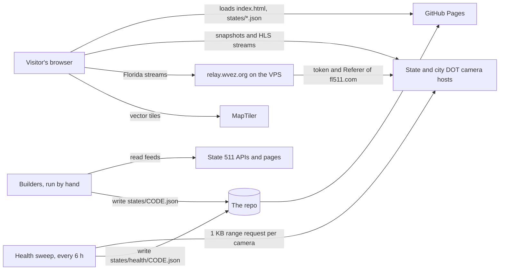
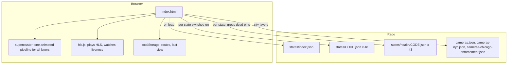

# Architecture

Ora is a static site with one exception. The visitor's browser loads one HTML file and
then the JSON for whichever states are switched on, and the agencies' own image and
stream hosts serve the pictures. The exception is the [stream relay](1.4-stream-relay.md):
Florida's stream host refuses any browser that is not on fl511.com, so a small service on
the VPS fetches those streams with fl511's headers and passes them on. Two scheduled jobs
keep the data honest: a builder rerun when a feed changes, and a health sweep every six
hours.

## System context

## Containers

## How a state gets on the map

1. A builder under `builders/` reads the agency's feed and writes `states/<CODE>.json`, a
   GeoJSON FeatureCollection with one feature per camera location, plus an entry in
   `states/index.json` with the name, count, map center, and whether video plays. The
   rules every builder follows are in [Sources](3-sources.md).
2. `index.html` reads the index at load to draw the sidebar and the coverage pins. When a
   state is switched on it fetches that state's file and its health file, adds the features
   to the shared cluster index, and marks any camera the sweep found dead.
3. Clicking a pin opens the popup. A video camera shows its snapshot as the poster and
   fades the stream in over it; a snapshot camera polls its image at the agency's measured
   or assumed cadence; a camera with no feed says so.

## How the browser judges a stream

hls.js feeds video through Media Source Extensions from a `blob:` URL, which is
same-origin, so the canvas is not tainted and the pixels are readable. Every 3.5 seconds
Ora checks that playback time is advancing and that two consecutive frames are not
identical. A real sensor is never perfectly still, so a repeated frame means a synthetic
one, and the red LIVE badge turns grey. A cross-origin snapshot cannot be inspected this
way, which is why the snapshot half of the truth is precomputed by the sweep and shipped
as data. See [Camera health](4-camera-health.md).

## What the two workflows do

| Workflow | When | What |
|---|---|---|
| `camera-health.yml` | Every six hours at 17 past | Runs `scripts/probe-health.py`, commits the verdicts as `health: Record the six hour camera sweep` |
| `docs.yml` | Every push and pull request | Runs the docs checker tests and `scripts/build_docs.py --check` |

## The one thing the site cannot do

It cannot hide a browser key or send a header the browser forbids. The MapTiler key in
`index.html` is therefore locked to this site's origin in the MapTiler dashboard
([decision 0006](6-decisions/0006-maptiler-key-in-the-page.md)). A camera host that
demands a `Referer` or an expiring token is documented as unplayable
([decision 0003](6-decisions/0003-cors-alone-proves-nothing.md)) unless its lock is
understood well enough to relay it through the VPS
([decision 0013](6-decisions/0013-relay-for-locked-streams.md)), which today is Florida.
