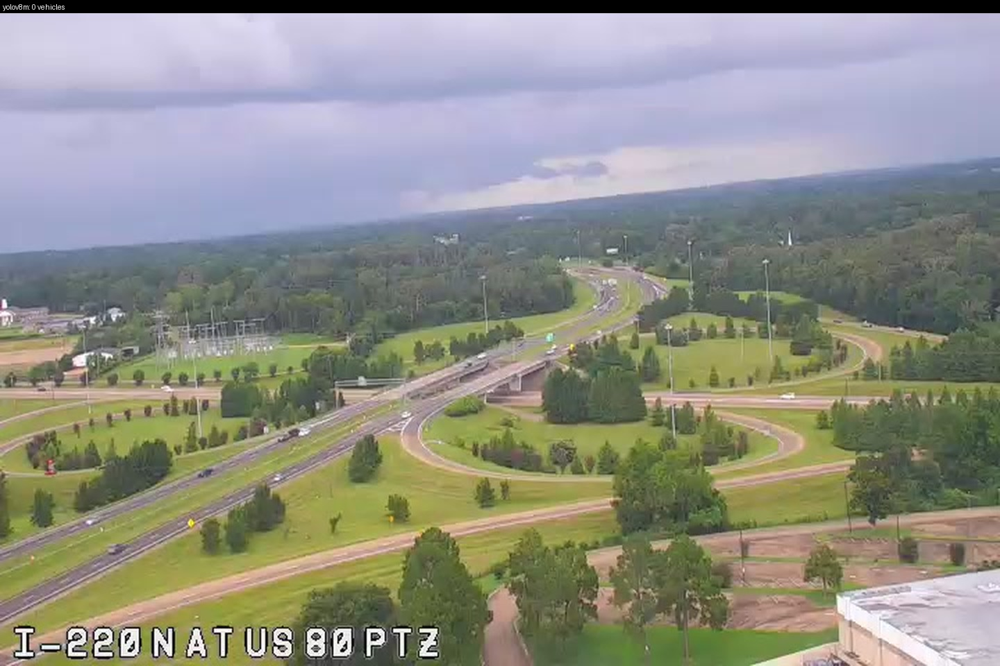
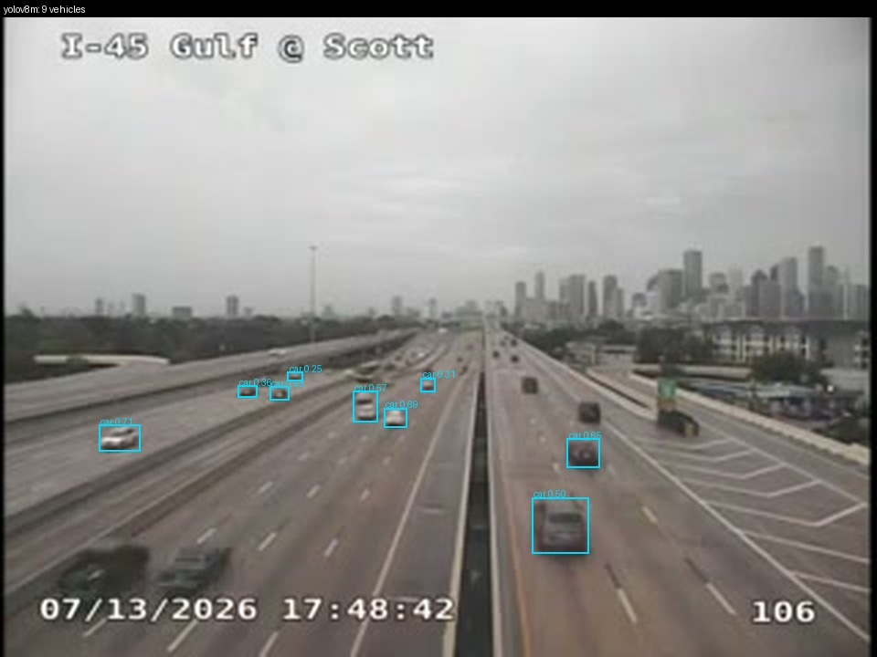
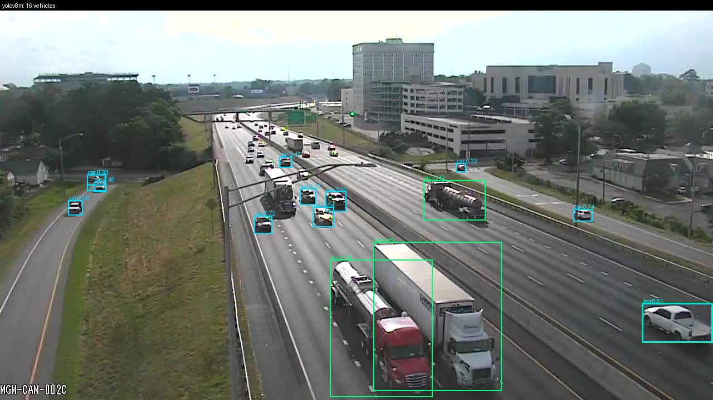
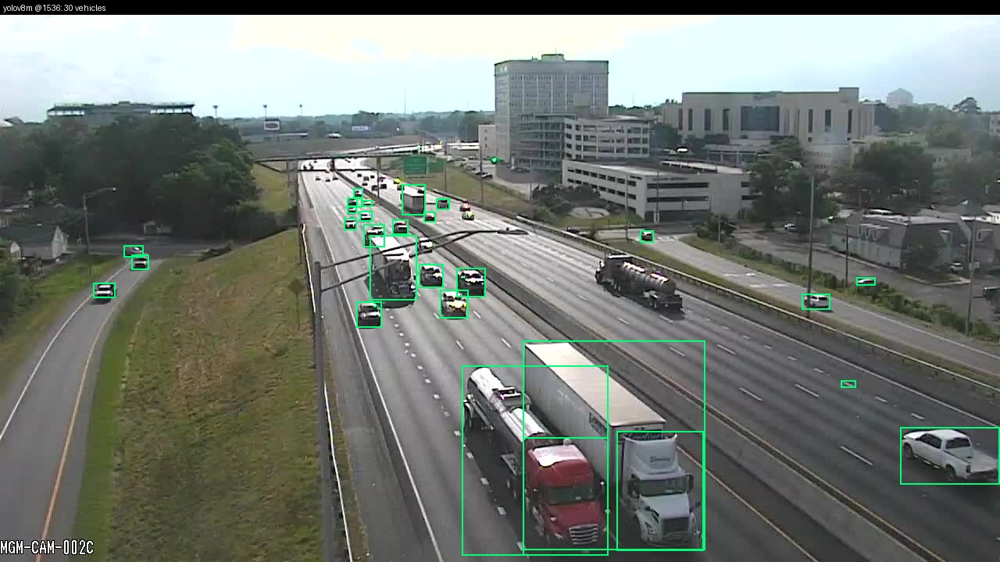
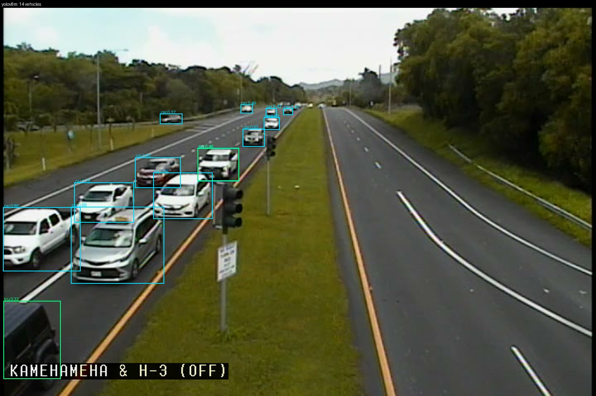
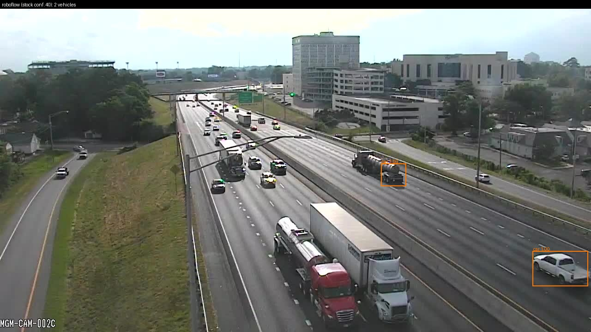

# YOLO transfer spike: does off-the-shelf vehicle detection work on Ora's cameras?

**Date:** 2026-07-13 | **Branch:** `yolo-spike` | **Verdict: NO, not today, and the reason is not the one we were testing for.**

24 frames harvested live from real Ora cameras this session (12 HLS video, 12 snapshot JPEG,
across TX SC MD MS FL NY HI WA IL AL KY RI and NYC). I counted the vehicles in each by eye.
Then I ran all three candidates cold, at defaults, no fine-tuning: **YOLOv8n**, **YOLOv8m**, and
the **Roboflow Universe vehicles model** (`roboflow-100/vehicles-q0x2v`, hosted inference).

---

## The verdict in one paragraph

The best cold model (YOLOv8m) lands at **46% bucket accuracy overall, 50% on video frames and
42% on snapshots**, against a threshold of 80% to ship. That is under the 50% line, which by the
brief's own rule means "domain gap is severe, harvest-and-label before any product feature."

**But the diagnosis behind that number is different from the one we set out to test, and it
changes the plan.** The failure is not that DOT pixels look alien to a COCO-trained model. Weather,
compression artifacts, and camera angle turned out to be survivable. The failure is **vehicle pixel
size**. Half of Ora's cameras do not deliver enough pixels on a car for *any* detector to see it,
and on the half that do, the default inference config throws the pixels away before the model
ever looks. Concretely:

- On cameras delivering **>=640px**, stock YOLOv8m with **no retraining** and one free
  inference change goes to **71% bucket accuracy** (and recovers 100% of ground truth on our two
  cleanest frames).
- On cameras delivering **<640px**, stock YOLOv8m scores **11% bucket accuracy**, and *no*
  inference setting rescues it. The information is not in the file.
- A network-wide probe (207 cameras, 50 layers) puts **roughly half the fleet in the workable tier
  and roughly half in the blind tier** (~49% / ~44%, but see the caveat below: a 3-camera sample per
  state is noisy enough that these exact percentages should not be planned against). Texas, our
  largest state, is **~90% blind** on a deeper 40-camera probe: TxDOT publishes a single 320x240 or
  352x240 variant per camera, with no higher rendition available.
- **The purpose-built vehicle model was the worst of the three, by a wide margin.** Roboflow's
  `vehicles-q0x2v` found **38 of 359 vehicles** where stock YOLOv8m found 186. See "Candidate 3"
  below; the short version is that buying a domain-specific model off the shelf is not a shortcut.

So the honest headline is not "off-the-shelf doesn't transfer." It is: **off-the-shelf transfers
about as well as the camera lets it, and half our cameras don't let it.** The first move is a
camera-capability census and an inference-config fix, both cheap. A fine-tune is the *second*
move, not the first, and it should only ever be trained and shipped on the cameras that can
physically support it.

---

## What the models actually saw

**Worst case, YOLOv8m: 0 detected of 18 actual.** MS I-220 at US-80, a tower PTZ over a full
cloverleaf. The frame is 720x480 (nominally "workable") but the camera is zoomed so far out that
vehicles are 5-10px. The model draws nothing at all. Resolution is necessary but not sufficient:
framing can kill you on its own.



**Video source type, and our biggest state: 9 of 23.** TX I-45 Gulf @ Scott, Houston, rush hour,
320x240. It finds the large foreground vehicles and loses the rest to haze and pixel count. It even
misses the two dark cars at the bottom-left frame edge. Tiling and upscaling move this to 10 of 23:
there is nothing left to recover.



**Snapshot source type, and the whole finding in two images.** AL I-85 Montgomery, 1280x720, the
cleanest pixels in the set. At stock defaults it gets **16 of 30**: it nails both semis and the
foreground cars, then stops dead past mid-frame. That cutoff is not weather and not compression.
It is ultralytics letterboxing a 1280px frame down to 640 before inference.



Same model, same weights, no retraining, just stop discarding the pixels (`imgsz=1536`): **30 of
30.** The mid-field queue that was invisible a moment ago is now fully boxed.



**Best case, cold, no help at all: 14 of 14.** HI Kamehameha Hwy at H-3, bright midday, low mount,
large foreground vehicles. When a camera hands YOLO a normal-sized car, YOLO finds it. This is the
control that proves the model is not the problem.



---

## Score tables

Ground truth is my own count. `bias` is mean signed error: negative means the model
**under-counts**. Note bias equals -MAE almost exactly for all three cold candidates, which
means every error is a **miss**: run cold, not one of them ever over-counts a frame.

`vehicles found / actual` is an upper bound on recall (it credits every box as a true hit).


**Overall** (n=24)

| model | count MAE | bias | bucket accuracy | vehicles found / actual |
|---|---|---|---|---|
| **1.** YOLOv8n (stock) | 10.2 | -10.2 | **33%** | 115/359 (32%) |
| **2.** YOLOv8m (stock) <-- best cold | 7.2 | -7.2 | **46%** | 186/359 (52%) |
| **3.** Roboflow vehicles-q0x2v (stock, conf .40) | 13.4 | -13.4 | **21%** | 38/359 (11%) |
| 3b. Roboflow @conf .25 (matched to YOLO) | 12.7 | -12.7 | **21%** | 54/359 (15%) |
| diag: YOLOv8m @1536 | 6.2 | -6.0 | **46%** | 214/359 (60%) |
| diag: YOLOv8m tiled 2x2 | 6.5 | -6.4 | **58%** | 205/359 (57%) |
| diag: Roboflow tiled 2x2 | 10.3 | -10.0 | **38%** | 119/359 (33%) |

**HLS video frames** (n=12)

| model | count MAE | bias | bucket accuracy | vehicles found / actual |
|---|---|---|---|---|
| **1.** YOLOv8n (stock) | 9.4 | -9.4 | **33%** | 40/153 (26%) |
| **2.** YOLOv8m (stock) <-- best cold | 6.6 | -6.6 | **50%** | 74/153 (48%) |
| **3.** Roboflow vehicles-q0x2v (stock, conf .40) | 11.2 | -11.2 | **33%** | 18/153 (12%) |
| 3b. Roboflow @conf .25 (matched to YOLO) | 10.8 | -10.8 | **33%** | 24/153 (16%) |
| diag: YOLOv8m @1536 | 6.8 | -6.8 | **42%** | 72/153 (47%) |
| diag: YOLOv8m tiled 2x2 | 6.8 | -6.6 | **58%** | 74/153 (48%) |
| diag: Roboflow tiled 2x2 | 9.3 | -9.0 | **42%** | 45/153 (29%) |

**Snapshot JPEGs** (n=12)

| model | count MAE | bias | bucket accuracy | vehicles found / actual |
|---|---|---|---|---|
| **1.** YOLOv8n (stock) | 10.9 | -10.9 | **33%** | 75/206 (36%) |
| **2.** YOLOv8m (stock) <-- best cold | 7.8 | -7.8 | **42%** | 112/206 (54%) |
| **3.** Roboflow vehicles-q0x2v (stock, conf .40) | 15.5 | -15.5 | **8%** | 20/206 (10%) |
| 3b. Roboflow @conf .25 (matched to YOLO) | 14.7 | -14.7 | **8%** | 30/206 (15%) |
| diag: YOLOv8m @1536 | 5.7 | -5.3 | **50%** | 142/206 (69%) |
| diag: YOLOv8m tiled 2x2 | 6.2 | -6.2 | **58%** | 131/206 (64%) |
| diag: Roboflow tiled 2x2 | 11.3 | -11.0 | **33%** | 74/206 (36%) |


### Bucket confusion, YOLOv8m stock (the headline model)

| actual | n | predicted light | predicted moderate | predicted heavy |
|---|---|---|---|---|
| light | 4 | **4** | 0 | 0 |
| moderate | 11 | 6 | **5** | 0 |
| heavy | 9 | 1 | 6 | **2** |

Every error slides **downhill**. Nothing is ever over-called. 6 of 9 heavy frames
read as moderate; 6 of 11 moderate frames read as light. The model is least reliable
exactly where traffic is worst, which is the opposite of what congestion detection needs.


## Per-frame results

Cold runs of all three candidates. `8m err` is the best cold model's signed error.

| frame | src | native | light/weather | GT | 8n | **8m** | RF | 8m err | 8m bucket |
|---|---|---|---|---|---|---|---|---|---|
| `MS_video_jackson-i20-i220` | vide | 720x480 | overcast, storm sky, wet | 18 | 0 | **0** | 2 | -18 | **MISS** heavy->light |
| `TX_video_dallas-ih35e-downtown` | vide | 352x240 | overcast, wet pavement | 23 | 2 | **7** | 0 | -16 | **MISS** heavy->moderate |
| `KY_snapshot_rural-i24-mp92` | snap | 1280x720 | hazy low sun | 28 | 5 | **13** | 1 | -15 | **MISS** heavy->moderate |
| `AL_snapshot_montgomery-i85-urban` | snap | 1280x720 | overcast bright | 30 | 10 | **16** | 2 | -14 | ok |
| `TX_video_houston-ih45-urban-freeway` | vide | 320x240 | overcast, hazy, wet pavement | 23 | 5 | **9** | 0 | -14 | **MISS** heavy->moderate |
| `IL_snapshot_chicago-urban` | snap | 720x480 | bright evening sun | 35 | 17 | **22** | 1 | -13 | ok |
| `WA_snapshot_seattle-i5-freeway` | snap | 335x249 | bright sun, hard shadow | 15 | 0 | **2** | 0 | -13 | **MISS** moderate->light |
| `NY_video_nyc-gowanus-i278` | vide | 352x240 | low sun, strong backlight haze | 25 | 10 | **15** | 1 | -10 | **MISS** heavy->moderate |
| `IL_snapshot_tollway-i88-suburban` | snap | 360x240 | bright low sun, hard shadows | 13 | 4 | **4** | 0 | -9 | **MISS** moderate->light |
| `NYC_snapshot_manhattan-dense` | snap | 352x240 | evening, shaded canyon | 17 | 8 | **8** | 9 | -9 | **MISS** heavy->moderate |
| `FL_video_tampa-i75-i4` | vide | 352x240 | overcast, storm sky | 13 | 1 | **4** | 0 | -9 | **MISS** moderate->light |
| `KY_snapshot_louisville-i264-urban` | snap | 1280x720 | golden hour, low sun into lens | 21 | 9 | **15** | 0 | -6 | **MISS** heavy->moderate |
| `WA_snapshot_rural-snoqualmie-pass` | snap | 320x239 | bright sun, pavement blown out white | 8 | 1 | **2** | 0 | -6 | **MISS** moderate->light |
| `SC_video_greenville-i85-freeway` | vide | 720x480 | overcast, wet pavement | 14 | 2 | **8** | 0 | -6 | ok |
| `AL_snapshot_rural-i65-mp206` | snap | 1280x720 | overcast, hazy | 6 | 5 | **3** | 0 | -3 | **MISS** moderate->light |
| `RI_snapshot_providence-henderson-bridge` | snap | 704x480 | soft evening light | 5 | 1 | **2** | 0 | -3 | ok |
| `MD_video_dc-intersection` | vide | 704x480 | low sun, heavy backlight and haze | 7 | 2 | **4** | 3 | -3 | **MISS** moderate->light |
| `MD_video_baltimore-i695-beltway` | vide | 640x480 | bright sun, hard shadows | 11 | 4 | **8** | 4 | -3 | ok |
| `RI_snapshot_providence-i195` | snap | 704x480 | soft evening light | 15 | 7 | **13** | 5 | -2 | ok |
| `NYC_snapshot_bronx-expressway` | snap | 1920x1080 | low sun, backlit, deep shadow under canopy | 13 | 8 | **12** | 2 | -1 | ok |
| `HI_video_honolulu-dillingham` | vide | 720x480 | bright midday sun, clear | 14 | 11 | **14** | 7 | +0 | ok |
| `MS_video_rural-i55-canton` | vide | 720x480 | overcast, storm sky | 4 | 2 | **4** | 0 | +0 | ok |
| `SC_video_charleston-surface-road` | vide | 480x270 | sunny with cloud | 1 | 1 | **1** | 1 | +0 | ok |
| `TX_video_rural-fm105-vidor` | vide | 352x240 | overcast after rain, standing water | 0 | 0 | **0** | 0 | +0 | ok |


## Manifest: the 24 frames

Every frame pulled live from a real Ora camera on 2026-07-13. `offroad` = vehicles in
adjacent lots/dealerships, excluded from ground truth (see `ground_truth.py` for the rule).
`?` = shapes I could not confidently call a vehicle; never scored.

| # | state | src | camera | local time | lighting | GT | ? | offroad | bucket |
|---|---|---|---|---|---|---|---|---|---|
| 1 | AL | snap | I-85 at Mulberry St ramps | 17:48 CDT | overcast bright | **30** | 6 | 8 | heavy |
| 2 | AL | snap | I-65 at MP 206 | 17:48 CDT | overcast, hazy | **6** | 3 | - | moderate |
| 3 | IL | snap | K.I.D.S. Camera 9 | 17:48 CDT | bright evening sun | **35** | 10 | - | heavy |
| 4 | IL | snap | Highland / I-88 EB Exit Ramp | 17:48 CDT | bright low sun, hard shadows | **13** | 5 | - | moderate |
| 5 | KY | snap | I-264 at Newburg Rd. | 18:48 EDT | golden hour, low sun into lens | **21** | 5 | 6 | heavy |
| 6 | KY | snap | I-24 WB @ MP 92.6 | 18:48 EDT | hazy low sun | **28** | 6 | - | heavy |
| 7 | NYC | snap | 6 Ave @ 42 St | 18:48 EDT | evening, shaded canyon | **17** | 4 | - | heavy |
| 8 | NYC | snap | C1-CBE-10-SB_at_Brx.Rvr_Pkwy-Ex4A | 18:48 EDT | low sun, backlit, deep shadow under canopy | **13** | 3 | - | moderate |
| 9 | RI | snap | I-195 E @ Rt 114 | 18:48 EDT | soft evening light | **15** | 6 | - | moderate |
| 10 | RI | snap | Henderson Bridge, Providence | 18:48 EDT | soft evening light | **5** | 1 | - | light |
| 11 | WA | snap | I-90 at MP 52: Snoqualmie Summit | 15:49 PDT | bright sun, pavement blown out white | **8** | 3 | - | moderate |
| 12 | WA | snap | I-5 at MP 162.9: Spokane St | 16:01 PDT | bright sun, hard shadow | **15** | 4 | - | moderate |
| 13 | FL | vide | I-75 SBM at I-4 | 18:49 EDT | overcast, storm sky | **13** | 6 | - | moderate |
| 14 | HI | vide | Kam Hwy and H-3 EB off ramp | 12:49 HST | bright midday sun, clear | **14** | 3 | - | moderate |
| 15 | MD | vide | Connecticut Ave (MD 185) at East West  | 18:49 EDT | low sun, heavy backlight and haze | **7** | 2 | - | moderate |
| 16 | MD | vide | I-695 I/L AT EX 20 MD 140 | 18:49 EDT | bright sun, hard shadows | **11** | 2 | - | moderate |
| 17 | MS | vide | I-20 at I-220 | 17:49 CDT | overcast, storm sky, wet | **18** | 8 | - | heavy |
| 18 | MS | vide | I-55 at MS 22 - Canton | 17:49 CDT | overcast, storm sky | **4** | 3 | 30 | light |
| 19 | NY | vide | I-278 at NY27 | 18:49 EDT | low sun, strong backlight haze | **25** | 15 | - | heavy |
| 20 | SC | vide | I-85 N @ MM 44 (White Horse Rd.) | 18:49 EDT | overcast, wet pavement | **14** | 3 | 12 | moderate |
| 21 | SC | vide | SC 703 Ben Sawyer Blvd NB @ North Poin | 18:49 EDT | sunny with cloud | **1** | 0 | - | light |
| 22 | TX | vide | IH-45 Gulf @ Scott | 17:49 CDT | overcast, hazy, wet pavement | **23** | 12 | - | heavy |
| 23 | TX | vide | IH35E @ Reunion | 17:49 CDT | overcast, wet pavement | **23** | 14 | - | heavy |
| 24 | TX | vide | FM105 @ FM1132 - Vidor NB | 17:49 CDT | overcast after rain, standing water | **0** | 2 | - | light |


---

## Candidate 3: the Roboflow vehicles model, and a prediction I got wrong

`roboflow-100/vehicles-q0x2v` is a purpose-built vehicle detector: 4,058 images, 31,641 labelled
cars, 12 vehicle classes and no person class, reporting **mAP 45.6 on its own test set**. On paper it
is the specialist and YOLOv8m is the generalist. Before running it I wrote down a prediction so it
could be scored: *"it will land close to YOLOv8m, because the binding constraint here is pixels on
target and a different set of COCO-ish weights does not add pixels."*

**That prediction was wrong, and not in a small way.** It did not land close to YOLOv8m. It landed
far below it, and below YOLOv8n too:

| | vehicles found of 359 | bucket accuracy | snapshot bucket accuracy |
|---|---|---|---|
| YOLOv8m (stock) | **186** | 46% | 42% |
| YOLOv8n (stock) | 115 | 33% | 33% |
| **Roboflow vehicles-q0x2v (stock)** | **38** | **21%** | **8%** |

Eight percent on snapshots: it put one frame of twelve in the right bucket. I ran it a second time at
confidence 0.25 to match ultralytics' default, in case its stock 0.40 threshold was doing the damage.
It barely moved (54 of 359).

Here is why the number is so low, and it is not the scale story:



That is the same clean 1280x720 Alabama frame where YOLOv8m found 16 cold and 30 at native
resolution. Roboflow finds **2** - and look at *which* 2. **It misses both articulated semi-trucks
in the foreground**, the largest and most obvious objects in the entire image, while boxing a pickup
at the frame edge. A scale-limited model cannot miss the biggest thing in the picture. This is a
generalization failure: whatever viewpoint `vehicles-q0x2v` was trained on, our high-mounted DOT
perspective is not it, and its 45.6 mAP is 45.6 mAP *on its own test set*, which tells us nothing
about our cameras.

I gave it the same 2x2 tiling that rescued YOLO, to be fair to it and to test whether scale was its
problem too. Tiling roughly doubled it (54 -> 119 of 359), which says scale is *part* of its problem,
but it still finished below stock YOLOv8m and it introduced a new one: **tiled Roboflow produced the
only false positives in the entire spike**, hallucinating 2 vehicles on the empty wet rural road in
Vidor, TX where every other configuration correctly returned zero.

**What this changes.** It does not falsify the scale thesis. My stated falsification criterion was
"if it beats YOLOv8m materially on the <640px cohort" - it does not; it scores near zero there too.
But it kills a tempting shortcut. The instinct to fix a domain gap by grabbing someone else's
domain-specific model off Roboflow Universe is exactly wrong here: the specialist was **5x worse
than the generalist**. If we want a model tuned to DOT cameras, we will have to tune it on *our*
frames. There is nothing to download.

---

## Why it fails: scale, not domain

The bias column tells the story before any diagnosis: **bias equals -MAE almost exactly**, meaning
at stock settings not one of the three candidates ever over-counts a single frame. There are no
hallucinated cars anywhere in the cold runs. Every error is a vehicle the model did not see. A
domain-gap failure (our pixels look *wrong* to the model) would produce both false positives and
false negatives. A scale failure produces only misses. We got only misses.

To separate the two causes I re-ran the same stock weights with only the *input scale* changed.
No fine-tuning, so any recovery is attributable to scale alone:

- `yolov8m @1536` - one pass, stop letterboxing down to 640.
- `yolov8m tiled` - 2x2 overlapping tiles at native resolution, merged with NMS (SAHI-style).

Split the 23 frames that contain vehicles by the resolution the camera actually delivered:

| cohort | n | stock recall | stock bucket acc | best-config recall | best-config bucket acc |
|---|---|---|---|---|---|
| native **>=640px** | 14 | 61% | **64%** | 75% | **71%** |
| native **<640px** | 9 | 38% | **11%** | 43% | **33%** |

That is the whole spike in one table. The >=640px cohort was never really broken; it was being
starved by a default. The <640px cohort cannot be fixed at inference time at all, because a car
that was captured as 6 real pixels does not become a car when you interpolate it to 30.

The exceptions are instructive and I am not going to paper over them:

- **MS Jackson** is 720x480 and still scores 0. Framing, not encoding: a tower PTZ zoomed to a
  whole interchange renders vehicles at 5-10px regardless of the file's dimensions.
- **MD I-695** got *worse* at 1536 (8 -> 3). Raising `imgsz` is not a free win on every frame, and
  a real rollout has to pick the input scale per camera, not globally.
- **AL Montgomery hitting exactly 30/30 is partly luck.** Looking at the boxes, it invents one on
  a lane marking and picks up two off-road parked cars, while still missing a couple of real ones.
  The count is right; it is not right vehicle-for-vehicle. Count MAE can be correct for the wrong
  reasons, which is why the annotated images are in the repo.

## Failure taxonomy

Every frame the best cold model got badly wrong, with the cause:

| frame | 8m vs GT | why |
|---|---|---|
| `MS_video_jackson-i20-i220` | 0 / 18 | tower PTZ zoomed to a whole cloverleaf; vehicles 5-10px, below the detector's floor entirely |
| `TX_video_dallas-ih35e-downtown` | 7 / 23 | 352x240; stacked viaducts stack traffic into a few pixels of vertical space; overcast haze |
| `KY_snapshot_rural-i24-mp92` | 13 / 28 | work-zone queue: vehicles occlude each other bumper-to-bumper; low-sun haze |
| `AL_snapshot_montgomery-i85-urban` | 16 / 30 | **recoverable**: 1280x720 downscaled to 640 by the default; everything past mid-frame lost. 30/30 at native res |
| `TX_video_houston-ih45-urban-freeway` | 9 / 23 | 320x240 + overcast haze flattening contrast; unrecoverable, tiling gets 10 |
| `IL_snapshot_chicago-urban` | 22 / 35 | sheer density (35 vehicles) plus interlace comb artifacts on every moving car |
| `WA_snapshot_seattle-i5-freeway` | 2 / 15 | 335x249; stacked ramp over mainline puts every vehicle in the far field |
| `NY_video_nyc-gowanus-i278` | 15 / 25 | 352x240 + strong backlit evening haze |
| `NYC_snapshot_manhattan-dense` | 8 / 17 | 352x240 + severe occlusion: taxis overlapping in a shaded canyon |
| `IL_snapshot_tollway-i88-suburban` | 4 / 13 | 360x240; the distant intersection is a pure compression smear |
| `FL_video_tampa-i75-i4` | 4 / 13 | 352x240; wide median puts most traffic in the small far field |
| `KY_snapshot_louisville-i264-urban` | 15 / 21 | **recoverable**: default downscale again. 21/21 at native res |
| `WA_snapshot_rural-snoqualmie-pass` | 2 / 8 | 320x239 + pavement blown out to pure white, killing vehicle/road contrast |
| `RI_snapshot_providence-henderson-bridge` | 2 / 5 | ~60% of the frame is tree canopy; the cars are parked behind foliage |

Ranked, the causes are:

1. **Vehicle pixel size below the detector's floor.** Dominant, by a wide margin. Two sub-causes:
   the source frame is small (TX/FL/NY/WA/NYC at 320-360px), or the frame is fine but the default
   `imgsz=640` letterbox shrinks it (AL/KY at 1280x720).
2. **Camera zoom/framing.** MS Jackson: a fine file, a useless field of view.
3. **Occlusion in dense queues.** NYC Manhattan, KY work zone. This one a fine-tune *can* fix.
4. **Low contrast from backlit haze** (TX Houston, NY Gowanus, MD DC) **or blown-out pavement**
   (WA Snoqualmie). A fine-tune can help here too.
5. **Foliage occlusion.** RI Henderson.
6. **Wrong training viewpoint.** Roboflow only: it misses even large, unoccluded, well-lit vehicles.

**What did *not* hurt, which surprised me:**

- **Compression artifacts are survivable.** IL Chicago has textbook interlace combing on every
  moving car and still returned one of the better results (22 of 35). Green chroma blobs on the
  wet TX Vidor road produced zero false positives.
- **Rain and wet pavement are survivable.** Five frames had wet roads. None failed *because* of it.
- **False positives are essentially absent.** In all three cold runs, across 24 frames, nothing was
  hallucinated: the empty wet rural road returned 0 predicted, 0 actual, from every candidate. The
  single exception in the whole spike is tiled Roboflow, which invented 2 cars there.

**One latent problem that is currently hidden.** Two frames have big off-road vehicle populations:
an equipment dealership on the SC I-85 shoulder (~12 vehicles) and a car dealership lot beside MS
I-55 (~30 cars). Stock YOLO boxes **none** of them, which looks like good news but is not: it is
only because it cannot see anything that small. On AL at native resolution, once the model *could*
see small vehicles, it immediately started boxing off-road parked cars. **Fixing the resolution
problem will surface a parking-lot false-positive problem that under-detection is currently
masking.** Tier 1 will need a per-camera road-mask ROI. Better to know that now than to discover it
after the fix lands and the density scores go strange next to every car dealership in America.

## How much of the fleet can support this at all?

If pixels-on-target is the binding constraint, then "what does each camera actually deliver" is the
roadmap question. I probed 207 cameras across all 50 layers (`resolution_census.py`):

| tier | cameras | share |
|---|---|---|
| **workable** (majority of sampled cams >=640px) | 22,755 | 49% |
| **mixed** (some >=640px) | 2,136 | 5% |
| **blind** (all sampled <640px) | 20,380 | 44% |
| unknown (probe failed) | 836 | 2% |
| **total** | **46,107** | matches the repo's ~46,100 |

Workable includes UT, MN, IL, OH, NC, SC, AL, KS, KY, DE, NE, ND, NM, SD, ME, RI, WV, AK, VT, MS, HI.
Blind includes **GA (4,043), CA (3,197), VA (1,684), WA (1,524), PA (1,522), OR, CO, MI, TN, IN, MD,
CT, LA, MA**.

**Treat that table as indicative, not decision-grade.** It samples 3 cameras per state per source
type, and I then deep-probed the three biggest video states (40 cameras each) to see how badly 3
samples lie. The answer is: badly, in both directions.

| state | cameras | 3-sample census said | 40-camera probe says |
|---|---|---|---|
| **TX** | 3,426 | 50% workable | **~10% workable** (35 of 39 were 320x240 or 352x240) |
| **NY** | 1,864 | 0%, blind | **34% workable** |
| **FL** | 4,904 | 60% workable | **55% workable** |

So the ~49/44 split is the right order of magnitude and the wrong precision. The qualitative
finding survives - roughly half the fleet cannot support detection - but nobody should plan a
roadmap against these exact percentages. That is precisely why a full per-camera census is
recommendation #2 rather than a nice-to-have.

**Texas needs its own line regardless.** Its master playlist offers a *single* variant with no
higher rendition, so 320x240 is not ffmpeg picking a low bitrate; it is what TxDOT publishes. **Our
largest state, 3,426 cameras, is ~90% blind**, and no amount of modelling changes that.

And the last caveat, which no census can capture: >=640px is **necessary but not sufficient**. MS
Jackson clears the resolution bar comfortably and still scores zero, because the camera is aimed at
a whole interchange. Framing has to be measured per camera too, and the only way to measure it is to
run the detector and look.

---

## Recommendation

**Do not start with a fine-tune, and do not go shopping for a better model.** The brief's <50% band
says "harvest-and-label before any product feature," and I would have agreed on the headline number
alone. Two things in the data say otherwise: a label pipeline would spend months teaching the model
to see cars it is *already capable of seeing*, and it would still be helpless on the ~44% of cameras
where the pixels do not exist. Candidate 3 separately shows that the "just download a vehicle-specific
model" shortcut leads somewhere much worse than where we started.

In order:

1. **Fix the inference config first. Free, days, no training.** Never run at the default 640
   letterbox. Run at native resolution or tiled. On the workable cohort this alone takes bucket
   accuracy from 64% to 71%, with two frames hitting 100% of ground truth. Pick the input scale per
   camera, not globally (MD I-695 got worse at 1536).

2. **Do a full per-camera resolution census. Cheap, days.** Extend `resolution_census.py` from 3
   cameras/state to all 46,100 and store the delivered resolution as a camera property. This
   partitions the fleet into what can support Tier 1 and what cannot, and it is a prerequisite for
   every downstream decision. It also tells us the true size of the addressable network, which right
   now we only know to +/- a lot.

3. **Ship Tier 1 density on the workable cohort only.** ~22,700 cameras is not a consolation prize,
   it is a real product. Gate the feature on the camera property from step 2. Do not ship a density
   score on a 320x240 Texas camera; it will be confidently wrong, and it will be wrong in the
   direction of "this jammed freeway looks empty."

4. **Then fine-tune, on our own harvested frames, and only for the workable cohort.** Target 71% ->
   85%+. The fine-tune must fix, in priority order: **(a) small distant vehicles** (the dominant
   miss even after the config fix), **(b) dense-queue occlusion** (KY work zone, NYC Manhattan),
   **(c) low-contrast backlit haze and blown-out pavement** (TX Houston, WA Snoqualmie). It does
   *not* need to fix compression artifacts or rain; those already work. Harvest must over-sample
   heavy frames, because that is where accuracy collapses and where the product's value lives.
   Start from **stock COCO YOLOv8m weights**, not from `vehicles-q0x2v` - candidate 3 is a worse
   starting point than the generalist.

5. **Add a per-camera road-mask ROI before, not after, the resolution fix.** Off-road parked
   vehicles are invisible today only because everything small is invisible. Fix one and you unmask
   the other.

6. **For the blind cohort, stop trying to count.** No model fixes 320x240. The options are: accept a
   coarser signal that does not need instance detection (frame-difference motion/occupancy, which
   can still answer "is this road busier than its own baseline"), ask the DOTs whether a
   higher-resolution feed exists behind a different endpoint, or exclude those cameras from
   per-camera insight and be honest in the UI about which cameras have it.

**A caveat I want on the record:** the fine-tune in step 4 is not proven to get us to 85%. It is the
reasonable next bet given that the remaining errors after the config fix are occlusion and contrast,
which are exactly what fine-tuning is good at. But the evidence in this spike only establishes the
scale finding. Step 4 deserves its own smaller spike (label ~200 frames, fine-tune, re-score against
this same harness) before anyone commits a quarter to it. I was already wrong once in this document
about what a model would do before I ran it, which is the argument for running it.

---

## What this means for the product, in plain language

We wanted to know whether a standard, free, pre-trained vehicle detector could look at our traffic
cameras and count cars. The answer is that it can count cars perfectly well. What it cannot do is
count cars it cannot see, and on about half of our cameras the picture is simply too small and too
blurry for anything to see a car in it. A car on a Texas camera is about six pixels across. There is
no clever software that recovers a car from six pixels, because the car was never really recorded in
the first place. That is not a problem with the AI. It is a problem with the picture the state of
Texas puts on the internet.

We also tried the obvious shortcut, a ready-made model that someone else had trained specifically to
find vehicles, on the theory that a specialist would beat a generalist. It was five times worse. It
failed to notice two enormous eighteen-wheelers sitting in the middle of the picture. The lesson is
that a model trained on somebody else's photos of cars is not trained on our photos of cars, and
there is no version of this we can simply download.

The good news is bigger than it sounds. On the other half of our cameras, the ones that publish a
decent picture, the free detector already works, and it works better the moment we stop shrinking the
image before showing it to the detector, which we were doing for no reason and can stop doing this
week. That is roughly twenty-two thousand cameras where traffic insight is achievable now, without
training anything, without labelling anything, and without spending money.

So the product plan changes shape. Instead of "build a big AI training pipeline and hope," it becomes
"find out which cameras have a good enough picture, turn the feature on for those, and be honest
about the rest." The thing that decides whether Ora can offer traffic insight on a given camera is
not how smart our model is. It is whether the DOT that owns that camera bothered to publish a decent
image. That is worth knowing before we spend a single day training a model, and it is the kind of
thing you only find out by pointing the model at the real cameras, which is what this spike did.

---

## Reproducing

```
cd spike && uv venv --python 3.12 .venv && uv pip install --python .venv/bin/python \
    ultralytics opencv-python-headless pillow requests numpy   # ffmpeg via brew

.venv/bin/python harvest.py            # pull 24 live frames -> frames/, manifest.json
.venv/bin/python ground_truth.py       # merge my counts into the manifest
.venv/bin/python detect.py             # candidates 1+2: stock YOLOv8n/8m -> detections.json
export ROBOFLOW_API_KEY=...            # free key: app.roboflow.com -> Settings -> API Keys
.venv/bin/python roboflow_detect.py    # candidate 3: hosted vehicles-q0x2v
.venv/bin/python diagnose.py           # the scale diagnostic: @1536 and tiled
.venv/bin/python score.py              # score tables -> scores.json
.venv/bin/python resolution_census.py  # fleet-wide capability probe
.venv/bin/python report_tables.py      # regenerate the tables in this report
```

The Roboflow key is read from the environment and is never written to disk or committed. Frames are
live captures and will differ on a re-run; the manifest records exactly which camera and what time
each came from. `zoom.py` / `crop.py` / `grid.py` are the magnification helpers I used to count
vehicles by eye. Nothing here is product code and nothing merges to `main`.

## What I did not test

- **Night.** Everything was harvested in one sitting, 12:49 HST to 18:49 EDT, so the set spans midday
  sun through low-angle evening haze but contains **no true darkness**. Night is where DOT cameras get
  grainy and headlight-smeared, and it is a real gap in this verdict. A short night harvest on the
  East Coast would close it and should happen before step 4.
- **Rain in progress.** Several frames are post-rain with wet pavement, but none are mid-downpour.
- **Tracking across frames.** This is a single-frame spike. Stall detection and flow direction need
  temporal information that one frame cannot provide.
- **Whether the fine-tune actually reaches 85%.** See the caveat above; that needs its own spike.
- **Other detector families.** I tested the three candidates in the brief. RT-DETR and the newer YOLO
  generations may raise the ceiling on the workable cohort, but none of them add pixels to a 320x240
  frame, so none of them change the shape of the recommendation.
